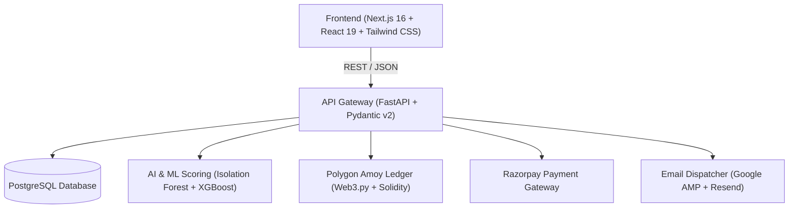

# Eleos: Autonomous Trust & Blockchain Philanthropy Platform

> **Empowering accountable, fraud-resistant philanthropy through AI feasibility scoring, transparent fiat payment channels, and cryptographic on-chain milestone verification.**

---

## 🌟 Executive Overview

**Eleos** bridges the trust deficit in modern charitable giving. By combining **machine learning anomaly detection**, **real-time statutory benchmark costing**, **Razorpay fiat donor gateways**, and **Polygon PoS blockchain anchoring**, Eleos guarantees donors that every rupee contributed is tied to verifiable, on-ground milestones.

### Key Innovations
1. **AI Trustability & Feasibility Engine**: Analyzes NGO financial filings and budget items using **Isolation Forest** (anomaly detection) and **XGBoost** trained on regional cost benchmarks.
2. **Cryptographic Milestone Ledger**: Anchors project budgets, video proofs, whistleblower flags, and governance attestations to the **Polygon Amoy Testnet** via the `EleosRegistry.sol` smart contract.
3. **Interactive Google AMP for Email**: Donors can vote directly from their Gmail inbox to approve or flag milestone video proofs with 1-click on-chain attestations.
4. **Transparent Fiat Gateway**: Seamless donor checkout via Razorpay with instant cryptographic receipt generation and real-time WebSocket state synchronization.

---

## 🏗️ Architecture & Technology Stack



| Layer | Technologies |
| :--- | :--- |
| **Frontend** | Next.js 16 (App Router), React 19, TypeScript, Tailwind CSS, Lucide Icons, Framer Motion |
| **Backend Gateway** | FastAPI, Uvicorn, Pydantic v2, Pydantic Settings, SQLAlchemy, WebSockets |
| **Persistence** | PostgreSQL 15+ (Local / Supabase Pooler), Redis (Pub/Sub & Caching) |
| **AI & Document Intelligence** | Scikit-Learn (Isolation Forest), XGBoost, Pandas, Google Gemini API / AWS Textract |
| **Blockchain** | Polygon Amoy Testnet (Chain ID 80002), Web3.py, Solidity (`EleosRegistry.sol`) |
| **Payments** | Razorpay Node/Python SDK, HMAC-SHA256 Webhook Verification |
| **Email & Governance** | Google AMP for Email, Resend API / SMTP |

---

## 🚀 Quick Start Guide

### Prerequisites
- **Python 3.11+**
- **Node.js 18+** & `npm`
- **PostgreSQL** (Local instance or free Supabase account)

---

### 1. Environment Setup

#### Backend Configuration
Copy the root environment template:
```bash
# In project root:
cp .env.example .env
```
*(Open `.env` and fill in your database credentials and optional API keys. Safe development defaults are already provided for testing).*

#### Frontend Configuration
Copy the frontend environment template:
```bash
# In project root:
cp frontend/.env.example frontend/.env.local
```

---

### 2. Database Initialization
Initialize database tables and pre-load standard regional cost benchmarks and demo personas:
```bash
# Using active Python environment:
python init_db.py --seed
```

---

### 3. Start the Backend API Gateway
```bash
# Start FastAPI gateway on http://localhost:8000
uvicorn backend.main:app --host 0.0.0.0 --port 8000 --reload
```
* Interactive API Documentation (Swagger): [http://localhost:8000/docs](http://localhost:8000/docs)
* Health Check Endpoint: [http://localhost:8000/health](http://localhost:8000/health)

---

### 4. Start the Frontend Dashboard
```bash
cd frontend
npm install
npm run dev
```
* Open [http://localhost:3000](http://localhost:3000) in your browser.

---

## 👥 Demo Personas & Pre-Seeded Accounts

Eleos features a **Universal Persona Switcher** in the UI to seamlessly review the platform from multiple stakeholders' viewpoints:

| Role | Seed Email | Password | Primary Capabilities |
| :--- | :--- | :--- | :--- |
| **Donor** | `riya.sharma@example.com` | `eleos@123` | Browse campaigns, donate via Razorpay, review video proof, vote on-chain |
| **NGO Admin** | `hoperelief@eleos.app` | `eleos@123` | Submit campaign budgets, upload compliance filings, publish milestones |
| **Auditor / Reviewer** | `reviewer@eleos.app` | `eleos@123` | Inspect AI anomaly flags, review statutory documents, approve milestone evidence |
| **Volunteer** | `kavya.patel@example.com` | `eleos@123` | Apply for ground relief opportunities, claim cryptographic soulbound credentials |

---

## 🧪 Testing & Verification

Run the comprehensive unit and integration test suite:
```bash
# Run Merkle anchoring and payment test suites
pytest tests/test_merkle_service.py razorpay/tests/ -v
```

---

## 📁 Repository Structure

```
EleosV1/
├── backend/            # FastAPI core routers, services & configuration
├── blockchain/         # Polygon Amoy smart contracts (Solidity) & Web3 services
├── database/           # SQLAlchemy models, schema DDL, and initial seed dataset
├── feasibility_data/   # Regional benchmark datasets for ML costing
├── frontend/           # Next.js 16 client application
├── models/             # Pre-trained ML anomaly and budgeting pipeline models
├── outputs/            # Canonical model validation, bias & sensitivity reports
├── razorpay/           # Fiat payment router, service & webhook verification
├── scripts/            # Pipeline flows, document extractors & benchmark loaders
├── tests/              # Verification test suites
├── .env.example        # Master environment variable template
├── init_db.py          # Database setup and migration runner
├── requirements.txt    # Backend Python dependencies
└── README.md           # Master documentation
```

---

## 📜 License
This project is developed for hackathon demonstration and open-source philanthropy auditability.

